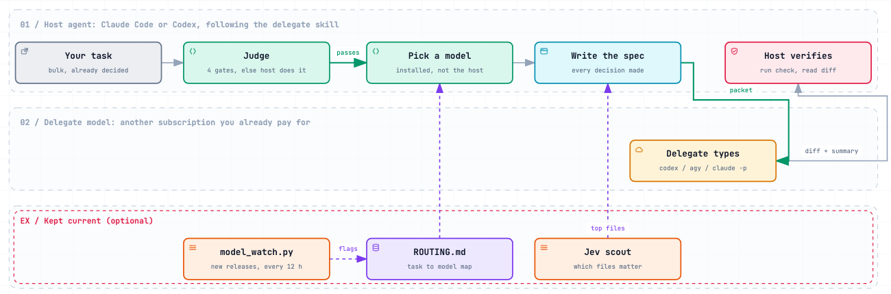

<picture>
  <source media="(prefers-color-scheme: dark)" srcset="docs/workflow-dark.png">
  
</picture>

# delegate-router

**One agent thinks, another types.** delegate-router is an agent skill for **Claude Code** and
**OpenAI Codex CLI**. It hands bulky, already-decided work (boilerplate, scaffolding, test stubs,
mechanical edits across many files, reading media and long documents) to another model you
already pay for: **Codex** (GPT models), **Gemini** through the Antigravity `agy` CLI, or a
**Claude Opus** subagent. The host keeps the design and the verification, and saves its own
quota and context.

- **Routing by task, not by habit.** [ROUTING.md](skills/delegate/ROUTING.md) maps each kind of
  task to an ordered list of models, chosen from independent benchmarks and cost per task.
  It skips any CLI you don't have and never routes back to the host's own model, except an
  Opus subagent under an Opus host, which keeps the main context clean.
- **A judge before every handoff.** Four gates (bulk, decided, verifiable, contained) and a
  never-delegate list (debugging, architecture, security code, anything under ~40 lines).
- **The host always verifies.** A delegate's "done" isn't evidence: the host runs the check and
  reads the diff.
- **An update path.** `model_watch.py` notices new model releases in your CLIs and the
  vendors' release notes, and can update the CLI and prove the new model answers.

Interactive diagram: [docs/workflow.html](docs/workflow.html) (open it locally).

## Requirements

- macOS or Linux, `git`, `python3` 3.9+.
- **Two or more** of: [Claude Code](https://code.claude.com/docs) (`claude`),
  [Codex CLI](https://github.com/openai/codex) (`codex`),
  [Antigravity CLI](https://antigravity.google) (`agy`). Each needs its own subscription or API
  access; delegate-router adds no accounts and no API keys.
- Optional: [uv](https://docs.astral.sh/uv/) and a TypeSafe key, only for Jev.

## Install

```bash
git clone https://github.com/pvjbuilds/delegate-router ~/.delegate-router
```

```bash
~/.delegate-router/install.sh
```

Clone to a fixed path: the install links to it, so moving the folder later breaks the links.

The installer finds your CLIs, links the skill, and asks a few questions. Enter takes the
default; `--yes` takes every default. Re-running it keeps your earlier answers.

| Question | Default | What it does |
|---|---|---|
| Install for Claude Code? | yes, if found | Links `~/.claude/skills/delegate`; no removes that link |
| Install for Codex CLI? | yes, if found | Links `~/.agents/skills/delegate`; no removes that link |
| Background checks for new models? | yes | At most every 12 h, only when the skill runs. No daemon, no cron. |
| Update the CLI and probe a new model? | no | Updates through the channel the CLI came from (Homebrew cask, npm, or its own updater), then sends a one-word, read-only probe |
| Turn on Jev? | no | See [Jev](#jev-optional) |

If `claude` is installed, the installer also links the `opus-implementer` agent into
`~/.claude/agents`: both hosts use it to reach Claude Opus.

It never overwrites a file or folder that isn't its own, and never edits your Claude Code or
Codex settings. It prints two optional snippets instead:

- **Codex as host.** Codex's sandbox blocks network by default, so calling the `claude` CLI
  from inside Codex asks for approval. Don't approve it: an approved command runs outside the
  sandbox. Instead add to `~/.codex/config.toml`, which keeps the sandbox on:

  ```toml
  [sandbox_workspace_write]
  network_access = true
  ```

- **Claude Code session-start notice.** A `SessionStart` hook that runs `model_watch.py status`,
  so new-model notices show when a session opens.

Restart Claude Code or Codex after installing.

## Use

Ask the host to delegate, or type `/delegate`:

> Delegate this: add typed stubs for the 14 endpoints in `api/routes.py`, one per function,
> each raising `NotImplementedError`.

The host judges the task, picks the model, writes the spec, runs the delegate, reads the diff
and reports back: what went where, what came back, what it fixed. Name a model to override the
map ("send this to Gemini").

## Routing, briefly

| Task | First choice | Fallback |
|---|---|---|
| Bulk code from a spec | GPT-6.1 Sol (Codex) | Claude Opus 5.5 |
| Must be right, or the first pick failed | Claude Opus 5.5 | GPT-6.1 Sol |
| Trivial mechanical edits | GPT-6 Luna (Codex) | Claude Opus 5.5 |
| Media, PDFs, long documents | Gemini 3.8 Flash (agy) | Claude Opus 5.5 |
| Hard reasoning, security review (read-only) | GPT-6 Astra (Codex) | Claude Opus 5.5 |

The reasons, effort levels, caveats and the council protocol for when two models disagree are
in [ROUTING.md](skills/delegate/ROUTING.md). Benchmarks are a prior; a check on the real task
beats them.

## Staying current

```bash
git -C ~/.delegate-router pull
```

That brings a newer routing map. Between releases, `model_watch.py` tells you what's new:

```bash
python3 ~/.delegate-router/skills/delegate/scripts/model_watch.py status
```

- `status` makes no network calls itself. It lists your delegate CLIs, any new release it
  found, and any model your CLIs list that ROUTING.md doesn't cover yet. With background checks
  on, it also starts `run --if-due` in the background, which goes online at most every 12 h.
- `run` does the checking: model catalogs (`codex debug models`, `agy models`, Anthropic's
  models page) and five vendor release-note pages. It's capped at 10 names, and every step,
  CLI update and probe included, stops at 15 minutes.
- `ack` marks everything current as reviewed.

State lives in `~/.local/state/delegate-router/`, settings in
`~/.config/delegate-router/config.env` (see [config.example.env](config.example.env)).

## Jev (optional)

[Jev](https://typesafe.ai) (TypeSafe) is a very cheap classifier, about $0.0001 per call.
Turned on, it does two jobs:

1. **Judges release notes.** Is a new name a real subscriber release, or API-only or a preview?
2. **Scouts files before a spec.** It ranks which files a task needs, so the host reads 5
   files instead of 40.

**Data gate:** Jev sends text to TypeSafe. Use it only on public or low-sensitivity code.
**Never** on client work, secrets, credentials or personal data. The scout skips secret-looking
files by name and content, but that's a pattern match, not a guarantee.

**Key:** `TYPESAFE_API_KEY` in your environment, or on macOS in the login keychain:

```bash
security add-generic-password -a "$USER" -s TYPESAFE_API_KEY -w
```

The key is never read from a file in this repo, never written to config and never printed.

## Safety

- **Codex** delegates run in Codex's sandbox: `workspace-write` to implement, `read-only` to
  review. Never full access, never a `--dangerously-bypass-*` flag. They skip your
  `config.toml` and execpolicy rules and turn apps off; plugins and admin-managed config can
  still apply.
- **Gemini** runs through `agy` in plan mode with `--sandbox`. It is still an agent: the
  handoff folder isn't a read boundary and your integrations stay on, so send it only packets
  you wrote.
- **Claude Opus** as an implementer runs with the Claude Code host's own permissions (turn on
  Claude Code's `/sandbox` for OS-level confinement), or inside Codex's sandbox when Codex is
  the host. As a reviewer it runs `--restricted` with only Read, Grep and Glob.
- Every Codex packet says "do not remove or weaken any existing test".
- Security, auth and money code is never typed by a delegate. A strong model may review it,
  read-only.
- New-model probes send one fixed prompt from an empty temp folder, with your CLI config,
  rules and integrations turned off where the CLI allows it, and pass only on an exact `ok`.
- Model names read from web pages are validated before they're printed or passed to a CLI.

## Uninstall

```bash
~/.delegate-router/uninstall.sh
```

This removes only its own links. Add `--purge` to also delete the config and state.

## Tests

```bash
python3 tests/test_model_watch.py && bash tests/test_install.sh
```

```bash
uv run -q tests/test_jev.py && uv run -q tests/test_scout.py
```

All offline: stub CLIs, local pages, a temp `HOME`. No network, no spend.

## FAQ

**Why a clone and an install script, not a plugin?** Both Claude Code and Codex support
plugins, and the folder is already laid out like one. A plugin can't ask setup questions, and
it would install a separate copy per host. A plugin package may follow; the skill itself won't
change.

**Does it work with only one agent installed?** It installs, but there's nothing to route to.
Delegation needs a second model.

**Will it spend my money?** Only through subscriptions you already have, when you delegate.
Background checks read public pages and your CLIs' model lists. Probes and Jev run only if you
turn them on.

## Keywords

Claude Code skill · Codex CLI skill · Agent Skills · SKILL.md · multi-model routing · LLM
router · model routing · AI coding agent · subagent · task delegation · Claude Opus 5.5 ·
GPT-6.1 Sol · GPT-6 Astra · Gemini 3.8 Flash · Antigravity agy · OpenAI Codex · Anthropic
Claude · Google Gemini · save tokens · quota · cost per task · code review council · cross-model
review · model release watcher · TypeSafe Jev

## License

MIT. See [LICENSE](LICENSE).
